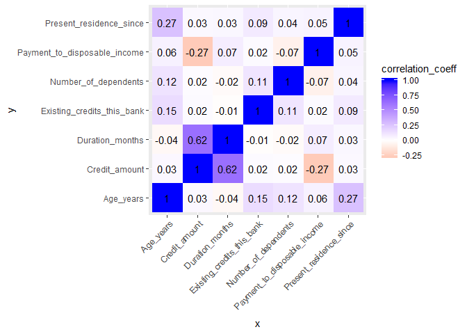
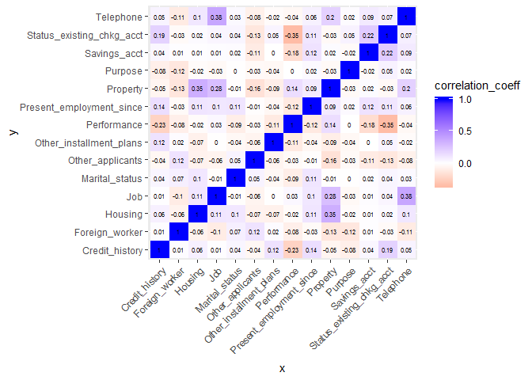

Ensembling workshop
================
Aaron Cooley
2/11/2019

Setting up
==========

Before beginning the process, we will need to install a number of libraries and packages. I highly recommend blocking about an hour and un-commenting the next code chunk (remove the number sign '\#' on each line) and then running it. This will install several hundred packages which allow mlr to do everything it needs to do.

Below are the libraries we ard going to need loaded for this tutorial. Having a library loaded means that its functions can be accessed directly inside your code.

``` r
library(ucimlr)
library(actools)
library(mlr)
```

    ## Loading required package: ParamHelpers

``` r
library(mlrMBO)
```

    ## Loading required package: smoof

    ## Loading required package: BBmisc

    ## 
    ## Attaching package: 'BBmisc'

    ## The following object is masked from 'package:actools':
    ## 
    ##     %btwn%

    ## The following object is masked from 'package:base':
    ## 
    ##     isFALSE

    ## Loading required package: checkmate

    ## Warning: package 'checkmate' was built under R version 3.5.2

``` r
library(tidyverse)
```

    ## -- Attaching packages --------------------------------------------------------------------------------------------------------- tidyverse 1.2.1.9000 --

    ## v ggplot2 3.1.0     v purrr   0.2.5
    ## v tibble  2.0.1     v dplyr   0.7.8
    ## v tidyr   0.8.2     v stringr 1.3.1
    ## v readr   1.3.1     v forcats 0.3.0

    ## Warning: package 'ggplot2' was built under R version 3.5.2

    ## Warning: package 'tibble' was built under R version 3.5.2

    ## Warning: package 'tidyr' was built under R version 3.5.2

    ## Warning: package 'readr' was built under R version 3.5.2

    ## -- Conflicts ----------------------------------------------------------------------------------------------------------------- tidyverse_conflicts() --
    ## x dplyr::coalesce() masks BBmisc::coalesce()
    ## x dplyr::collapse() masks BBmisc::collapse()
    ## x dplyr::filter()   masks stats::filter()
    ## x dplyr::lag()      masks stats::lag()

Reading data
============

We are going to load in a data set from a German bank which contains data on 1,000 loans, including data that was available at time of application that will serve as predictor variables, and the performance of that loan (whether or not it was paid back) which will serve as the target variable. Details on the data are available at:

<https://archive.ics.uci.edu/ml/datasets/statlog+(german+credit+data)>

We will then summarize each column (variable) to get a basic understanding of the distributions of the data.

``` r
german <- read_ucimlr("german")
```

    ## Parsed with column specification:
    ## cols(
    ##   .default = col_character(),
    ##   X2 = col_double(),
    ##   X5 = col_double(),
    ##   X8 = col_double(),
    ##   X11 = col_double(),
    ##   X13 = col_double(),
    ##   X16 = col_double(),
    ##   X18 = col_double(),
    ##   X21 = col_double()
    ## )

    ## See spec(...) for full column specifications.

``` r
summarizeColumns(german)
```

    ##                            name    type na     mean         disp median
    ## 1     Status_existing_chkg_acct  factor  0       NA    0.6060000     NA
    ## 2               Duration_months numeric  0   20.903   12.0588145   18.0
    ## 3                Credit_history  factor  0       NA    0.4700000     NA
    ## 4                       Purpose  factor  0       NA    0.7200000     NA
    ## 5                 Credit_amount numeric  0 3271.258 2822.7368760 2319.5
    ## 6                  Savings_acct  factor  0       NA    0.3970000     NA
    ## 7      Present_employment_since  factor  0       NA    0.6610000     NA
    ## 8  Payment_to_disposable_income numeric  0    2.973    1.1187147    3.0
    ## 9                Marital_status  factor  0       NA    0.4520000     NA
    ## 10             Other_applicants  factor  0       NA    0.0930000     NA
    ## 11      Present_residence_since numeric  0    2.845    1.1037179    3.0
    ## 12                     Property  factor  0       NA    0.6680000     NA
    ## 13                    Age_years numeric  0   35.546   11.3754686   33.0
    ## 14      Other_installment_plans  factor  0       NA    0.1860000     NA
    ## 15                      Housing  factor  0       NA    0.2870000     NA
    ## 16   Existing_credits_this_bank numeric  0    1.407    0.5776545    1.0
    ## 17                          Job  factor  0       NA    0.3700000     NA
    ## 18         Number_of_dependents numeric  0    1.155    0.3620858    1.0
    ## 19                    Telephone  factor  0       NA    0.4040000     NA
    ## 20               Foreign_worker  factor  0       NA    0.0370000     NA
    ## 21                  Performance numeric  0    1.300    0.4584869    1.0
    ##          mad min   max nlevs
    ## 1         NA  63   394     4
    ## 2     8.8956   4    72     0
    ## 3         NA  40   530     5
    ## 4         NA   9   280    10
    ## 5  1627.1535 250 18424     0
    ## 6         NA  48   603     5
    ## 7         NA  62   339     5
    ## 8     1.4826   1     4     0
    ## 9         NA  50   548     4
    ## 10        NA  41   907     3
    ## 11    1.4826   1     4     0
    ## 12        NA 154   332     4
    ## 13   10.3782  19    75     0
    ## 14        NA  47   814     3
    ## 15        NA 108   713     3
    ## 16    0.0000   1     4     0
    ## 17        NA  22   630     4
    ## 18    0.0000   1     2     0
    ## 19        NA 404   596     2
    ## 20        NA  37   963     2
    ## 21    0.0000   1     2     0

You will notice that some columns show as type 'factor' and others as type 'numeric'. Factor variables contain categorial information (e.g. sex, own vs. rent, etc.), whereas numeric variables are measured with a number (e.g. height, weight or age). All learning algorithms can handle numeric variables, but not all can handle factor variables without some preprocessing.

The column summary handles factor and numeric variables differently. Summary statistics for numeric variables include mean, dispersion (standard deviation), median, mean absolute deviation (MAD, a metric similar to standard deviation), the minimum value, and the maximum value. Summary statistics for factor variables include dispersion (variation ratio, or the percentage of observations not equal to the mode), the number of observations in the least common category, the number of observations in the most common category, and the total number of categories.

The original data set uses codes for the factors that don't make any sense. We are going to recode the factors so that they are human readable and make more sense. We will use the information supplied on the website where we pulled the original data set. Then we will plot the distributions of each variable so that we can start to understand our data set.

``` r
german <- german %>%
  mutate(Status_existing_chkg_acct = recode(Status_existing_chkg_acct,
                                            A11 = '<0',
                                            A12 = '0-<200',
                                            A13 = '200+',
                                            A14 = 'no checking account'),
         Credit_history = recode(Credit_history,
                                 A30 = 'No remaining balance at any bank',
                                 A31 = 'No remaining balance at this bank',
                                 A32 = 'No prior delinquency',
                                 A33 = 'Prior delinquency',
                                 A34 = 'Remaining balance at another bank'),
         Purpose = recode(Purpose,
                          A40 = 'Car (new)',
                          A41 = 'Car (used)',
                          A42 = 'Furniture/equipment',
                          A43 = 'Radio/television',
                          A44 = 'Domestic appliances',
                          A45 = 'Repairs',
                          A46 = 'Education',
                          A47 = 'Vacation',
                          A48 = 'Retraining',
                          A49 = 'Business',
                          A410 = 'Other'),
         Savings_acct = recode(Savings_acct,
                               A61 = '<100',
                               A62 = '100-<500',
                               A63 = '500-<1000',
                               A64 = '1000+',
                               A65 = 'unknown/none'),
         Present_employment_since = recode(Present_employment_since,
                                           A71 = 'Unemployed',
                                           A72 = '<1 year',
                                           A73 = '1-<4 years',
                                           A74 = '4-<7 years',
                                           A75 = '7+ years'),
         Marital_status = recode(Marital_status,
                                 A91 = 'Male - Divorced/Separated',
                                 A92 = 'Female - Divorced/Separated/Married',
                                 A93 = 'Male - Single',
                                 A94 = 'Male - Married/Widowed',
                                 A95 = 'Female - Single'),
         Other_applicants = recode(Other_applicants,
                                   A101 = 'none',
                                   A102 = 'co-applicant',
                                   A103 = 'guarantor'),
         Property = recode(Property,
                           A121 = 'real estate',
                           A122 = 'savings or life insurance',
                           A123 = 'car or other',
                           A124 = 'unknown or none'),
         Other_installment_plans = recode(Other_installment_plans,
                                          A141 = 'bank',
                                          A142 = 'stores',
                                          A143 = 'none'),
         Housing = recode(Housing,
                          A151 = 'rent',
                          A152 = 'own',
                          A153 = 'for free'),
         Job = recode(Job,
                      A171 = 'unemployed/unskilled/non-resident',
                      A172 = 'unskilled - resident',
                      A173 = 'skilled/official',
                      A174 = 'management/self-employed/highly qualified'),
         Telephone = recode(Telephone,
                            A191 = 'none',
                            A192 = 'yes'),
         Foreign_worker = recode(Foreign_worker,
                                 A201 = 'yes',
                                 A202 = 'no'),
         Performance = recode_factor(Performance,
                                     `1` = 'Good',
                                     `2` = 'Bad'))

factor_features <- names(german)[sapply(german, is.factor)]
map(factor_features, ~ ggplot(german, aes_string(x = .x)) + geom_histogram(stat = 'count') +
      theme(axis.text.x = element_text(angle = 45, hjust = 1)))
```

    ## Warning: Ignoring unknown parameters: binwidth, bins, pad

    ## Warning: Ignoring unknown parameters: binwidth, bins, pad

    ## Warning: Ignoring unknown parameters: binwidth, bins, pad

    ## Warning: Ignoring unknown parameters: binwidth, bins, pad

    ## Warning: Ignoring unknown parameters: binwidth, bins, pad

    ## Warning: Ignoring unknown parameters: binwidth, bins, pad

    ## Warning: Ignoring unknown parameters: binwidth, bins, pad

    ## Warning: Ignoring unknown parameters: binwidth, bins, pad

    ## Warning: Ignoring unknown parameters: binwidth, bins, pad

    ## Warning: Ignoring unknown parameters: binwidth, bins, pad

    ## Warning: Ignoring unknown parameters: binwidth, bins, pad

    ## Warning: Ignoring unknown parameters: binwidth, bins, pad

    ## Warning: Ignoring unknown parameters: binwidth, bins, pad

    ## Warning: Ignoring unknown parameters: binwidth, bins, pad

    ## [[1]]


    ## 
    ## [[2]]


    ## 
    ## [[3]]


    ## 
    ## [[4]]


    ## 
    ## [[5]]


    ## 
    ## [[6]]


    ## 
    ## [[7]]


    ## 
    ## [[8]]


    ## 
    ## [[9]]


    ## 
    ## [[10]]


    ## 
    ## [[11]]


    ## 
    ## [[12]]


    ## 
    ## [[13]]


    ## 
    ## [[14]]


``` r
numeric_features <- names(german)[!sapply(german, is.factor)]
map(numeric_features, ~ ggplot(german, aes_string(x = .x)) + geom_histogram())
```

    ## [[1]]

    ## `stat_bin()` using `bins = 30`. Pick better value with `binwidth`.


    ## 
    ## [[2]]

    ## `stat_bin()` using `bins = 30`. Pick better value with `binwidth`.


    ## 
    ## [[3]]

    ## `stat_bin()` using `bins = 30`. Pick better value with `binwidth`.


    ## 
    ## [[4]]

    ## `stat_bin()` using `bins = 30`. Pick better value with `binwidth`.


    ## 
    ## [[5]]

    ## `stat_bin()` using `bins = 30`. Pick better value with `binwidth`.


    ## 
    ## [[6]]

    ## `stat_bin()` using `bins = 30`. Pick better value with `binwidth`.


    ## 
    ## [[7]]

    ## `stat_bin()` using `bins = 30`. Pick better value with `binwidth`.


In order to set up a machine learning problem in mlr, you will need to create a task. At minimum, a task consists of the following information:

-   Data set to be used in prediction
-   Name of the target variable
-   Type of prediction to be done (i.e. classification, regression, etc.)

Since we are doing classification, predicting whether a loan will fall into the "paid back" or "not paid back" category, we will create a classification task using `makeClassifTask()`. We also need to make sure the Performance variable is a factor, which we did in the previous step.

``` r
task <- makeClassifTask(data = german, target = "Performance")
print(task)
```

    ## Supervised task: german
    ## Type: classif
    ## Target: Performance
    ## Observations: 1000
    ## Features:
    ##    numerics     factors     ordered functionals 
    ##           7          13           0           0 
    ## Missings: FALSE
    ## Has weights: FALSE
    ## Has blocking: FALSE
    ## Has coordinates: FALSE
    ## Classes: 2
    ## Good  Bad 
    ##  700  300 
    ## Positive class: Good

Once you create a task, you can `print()` it to see a quick summary of the task information. In this case, we are told that we are performing classification of the 'Performance' variable, that we have 7 numeric and 13 factor variables as predictors, that our target variable has two classes, 1 and 2 respectively, and that there are 700 observations in class 1 (the "positive class") vs. 300 in class 2. A classification task is going to return either a binary prediction of 0 or 1, or a probability prediction between 0 and 1. In either case, a prediction of 1 refers to the positive class ("paid back"), and a prediction of 0 referse to the negative class ("not paid back"). So, for example, a probability predction of 0.7 roughly corresponds to a 70% chance of the loan being paid back.

Feature transformation
======================

Not every learning algorithm can handle factor variables. For example, a logistic regression requires each predictor variable to be assigned a coefficient that it can be multiplied with. It's easy to assign a coefficient to 'Age\_years' of 30 or 'Duration\_months' of 5. It's not possible to assign a coefficient to 'Purpose' of "Education". The way that this is normally handled is what's called "one hot encoding", which simply means creating a numeric variable for every possible category and assigning it either a 1 or a 0. So in this case, 'Purpose' is split into one column for each possible category, e.g. "Purpose.Repairs", "Purpose.Education", etc., and each column either receives a 1 or a 0.

``` r
german %>%
  normalizeFeatures() %>%
  head()
```

    ##   Status_existing_chkg_acct Duration_months
    ## 1                        <0      -1.2358595
    ## 2                    0-<200       2.2470700
    ## 3       no checking account      -0.7382981
    ## 4                        <0       1.7495086
    ## 5                        <0       0.2568246
    ## 6       no checking account       1.2519473
    ##                      Credit_history             Purpose Credit_amount
    ## 1 Remaining balance at another bank    Radio/television    -0.7447588
    ## 2              No prior delinquency    Radio/television     0.9493418
    ## 3 Remaining balance at another bank           Education    -0.4163541
    ## 4              No prior delinquency Furniture/equipment     1.6334296
    ## 5                 Prior delinquency           Car (new)     0.5663801
    ## 6              No prior delinquency           Education     2.0489838
    ##   Savings_acct Present_employment_since Payment_to_disposable_income
    ## 1 unknown/none                 7+ years                   0.91801781
    ## 2         <100               1-<4 years                  -0.86974813
    ## 3         <100               4-<7 years                  -0.86974813
    ## 4         <100               4-<7 years                  -0.86974813
    ## 5         <100               1-<4 years                   0.02413484
    ## 6 unknown/none               1-<4 years                  -0.86974813
    ##                        Marital_status Other_applicants
    ## 1                       Male - Single             none
    ## 2 Female - Divorced/Separated/Married             none
    ## 3                       Male - Single             none
    ## 4                       Male - Single        guarantor
    ## 5                       Male - Single             none
    ## 6                       Male - Single             none
    ##   Present_residence_since                  Property   Age_years
    ## 1               1.0464631               real estate  2.76507291
    ## 2              -0.7655942               real estate -1.19080809
    ## 3               0.1404344               real estate  1.18272051
    ## 4               1.0464631 savings or life insurance  0.83108664
    ## 5               1.0464631           unknown or none  1.53435438
    ## 6               1.0464631           unknown or none -0.04799802
    ##   Other_installment_plans  Housing Existing_credits_this_bank
    ## 1                    none      own                  1.0265652
    ## 2                    none      own                 -0.7045734
    ## 3                    none      own                 -0.7045734
    ## 4                    none for free                 -0.7045734
    ## 5                    none for free                  1.0265652
    ## 6                    none for free                 -0.7045734
    ##                    Job Number_of_dependents Telephone Foreign_worker
    ## 1     skilled/official           -0.4280754       yes            yes
    ## 2     skilled/official           -0.4280754      none            yes
    ## 3 unskilled - resident            2.3337012      none            yes
    ## 4     skilled/official            2.3337012      none            yes
    ## 5     skilled/official            2.3337012      none            yes
    ## 6 unskilled - resident            2.3337012       yes            yes
    ##   Performance
    ## 1        Good
    ## 2         Bad
    ## 3        Good
    ## 4        Good
    ## 5         Bad
    ## 6        Good

``` r
german %>%
  normalizeFeatures() %>%
  createDummyFeatures() %>%
  head()
```

    ##   Duration_months Credit_amount Payment_to_disposable_income
    ## 1      -1.2358595    -0.7447588                   0.91801781
    ## 2       2.2470700     0.9493418                  -0.86974813
    ## 3      -0.7382981    -0.4163541                  -0.86974813
    ## 4       1.7495086     1.6334296                  -0.86974813
    ## 5       0.2568246     0.5663801                   0.02413484
    ## 6       1.2519473     2.0489838                  -0.86974813
    ##   Present_residence_since   Age_years Existing_credits_this_bank
    ## 1               1.0464631  2.76507291                  1.0265652
    ## 2              -0.7655942 -1.19080809                 -0.7045734
    ## 3               0.1404344  1.18272051                 -0.7045734
    ## 4               1.0464631  0.83108664                 -0.7045734
    ## 5               1.0464631  1.53435438                  1.0265652
    ## 6               1.0464631 -0.04799802                 -0.7045734
    ##   Number_of_dependents Status_existing_chkg_acct..0
    ## 1           -0.4280754                            1
    ## 2           -0.4280754                            0
    ## 3            2.3337012                            0
    ## 4            2.3337012                            1
    ## 5            2.3337012                            1
    ## 6            2.3337012                            0
    ##   Status_existing_chkg_acct.0..200 Status_existing_chkg_acct.200.
    ## 1                                0                              0
    ## 2                                1                              0
    ## 3                                0                              0
    ## 4                                0                              0
    ## 5                                0                              0
    ## 6                                0                              0
    ##   Status_existing_chkg_acct.no.checking.account
    ## 1                                             0
    ## 2                                             0
    ## 3                                             1
    ## 4                                             0
    ## 5                                             0
    ## 6                                             1
    ##   Credit_history.No.remaining.balance.at.any.bank
    ## 1                                               0
    ## 2                                               0
    ## 3                                               0
    ## 4                                               0
    ## 5                                               0
    ## 6                                               0
    ##   Credit_history.No.remaining.balance.at.this.bank
    ## 1                                                0
    ## 2                                                0
    ## 3                                                0
    ## 4                                                0
    ## 5                                                0
    ## 6                                                0
    ##   Credit_history.No.prior.delinquency Credit_history.Prior.delinquency
    ## 1                                   0                                0
    ## 2                                   1                                0
    ## 3                                   0                                0
    ## 4                                   1                                0
    ## 5                                   0                                1
    ## 6                                   1                                0
    ##   Credit_history.Remaining.balance.at.another.bank Purpose.Car..new.
    ## 1                                                1                 0
    ## 2                                                0                 0
    ## 3                                                1                 0
    ## 4                                                0                 0
    ## 5                                                0                 1
    ## 6                                                0                 0
    ##   Purpose.Car..used. Purpose.Other Purpose.Furniture.equipment
    ## 1                  0             0                           0
    ## 2                  0             0                           0
    ## 3                  0             0                           0
    ## 4                  0             0                           1
    ## 5                  0             0                           0
    ## 6                  0             0                           0
    ##   Purpose.Radio.television Purpose.Domestic.appliances Purpose.Repairs
    ## 1                        1                           0               0
    ## 2                        1                           0               0
    ## 3                        0                           0               0
    ## 4                        0                           0               0
    ## 5                        0                           0               0
    ## 6                        0                           0               0
    ##   Purpose.Education Purpose.Retraining Purpose.Business Savings_acct..100
    ## 1                 0                  0                0                 0
    ## 2                 0                  0                0                 1
    ## 3                 1                  0                0                 1
    ## 4                 0                  0                0                 1
    ## 5                 0                  0                0                 1
    ## 6                 1                  0                0                 0
    ##   Savings_acct.100..500 Savings_acct.500..1000 Savings_acct.1000.
    ## 1                     0                      0                  0
    ## 2                     0                      0                  0
    ## 3                     0                      0                  0
    ## 4                     0                      0                  0
    ## 5                     0                      0                  0
    ## 6                     0                      0                  0
    ##   Savings_acct.unknown.none Present_employment_since.Unemployed
    ## 1                         1                                   0
    ## 2                         0                                   0
    ## 3                         0                                   0
    ## 4                         0                                   0
    ## 5                         0                                   0
    ## 6                         1                                   0
    ##   Present_employment_since..1.year Present_employment_since.1..4.years
    ## 1                                0                                   0
    ## 2                                0                                   1
    ## 3                                0                                   0
    ## 4                                0                                   0
    ## 5                                0                                   1
    ## 6                                0                                   1
    ##   Present_employment_since.4..7.years Present_employment_since.7..years
    ## 1                                   0                                 1
    ## 2                                   0                                 0
    ## 3                                   1                                 0
    ## 4                                   1                                 0
    ## 5                                   0                                 0
    ## 6                                   0                                 0
    ##   Marital_status.Male...Divorced.Separated
    ## 1                                        0
    ## 2                                        0
    ## 3                                        0
    ## 4                                        0
    ## 5                                        0
    ## 6                                        0
    ##   Marital_status.Female...Divorced.Separated.Married
    ## 1                                                  0
    ## 2                                                  1
    ## 3                                                  0
    ## 4                                                  0
    ## 5                                                  0
    ## 6                                                  0
    ##   Marital_status.Male...Single Marital_status.Male...Married.Widowed
    ## 1                            1                                     0
    ## 2                            0                                     0
    ## 3                            1                                     0
    ## 4                            1                                     0
    ## 5                            1                                     0
    ## 6                            1                                     0
    ##   Other_applicants.none Other_applicants.co.applicant
    ## 1                     1                             0
    ## 2                     1                             0
    ## 3                     1                             0
    ## 4                     0                             0
    ## 5                     1                             0
    ## 6                     1                             0
    ##   Other_applicants.guarantor Property.real.estate
    ## 1                          0                    1
    ## 2                          0                    1
    ## 3                          0                    1
    ## 4                          1                    0
    ## 5                          0                    0
    ## 6                          0                    0
    ##   Property.savings.or.life.insurance Property.car.or.other
    ## 1                                  0                     0
    ## 2                                  0                     0
    ## 3                                  0                     0
    ## 4                                  1                     0
    ## 5                                  0                     0
    ## 6                                  0                     0
    ##   Property.unknown.or.none Other_installment_plans.bank
    ## 1                        0                            0
    ## 2                        0                            0
    ## 3                        0                            0
    ## 4                        0                            0
    ## 5                        1                            0
    ## 6                        1                            0
    ##   Other_installment_plans.stores Other_installment_plans.none Housing.rent
    ## 1                              0                            1            0
    ## 2                              0                            1            0
    ## 3                              0                            1            0
    ## 4                              0                            1            0
    ## 5                              0                            1            0
    ## 6                              0                            1            0
    ##   Housing.own Housing.for.free Job.unemployed.unskilled.non.resident
    ## 1           1                0                                     0
    ## 2           1                0                                     0
    ## 3           1                0                                     0
    ## 4           0                1                                     0
    ## 5           0                1                                     0
    ## 6           0                1                                     0
    ##   Job.unskilled...resident Job.skilled.official
    ## 1                        0                    1
    ## 2                        0                    1
    ## 3                        1                    0
    ## 4                        0                    1
    ## 5                        0                    1
    ## 6                        1                    0
    ##   Job.management.self.employed.highly.qualified Telephone.none
    ## 1                                             0              0
    ## 2                                             0              1
    ## 3                                             0              1
    ## 4                                             0              1
    ## 5                                             0              1
    ## 6                                             0              0
    ##   Telephone.yes Foreign_worker.yes Foreign_worker.no Performance.Good
    ## 1             1                  1                 0                1
    ## 2             0                  1                 0                0
    ## 3             0                  1                 0                1
    ## 4             0                  1                 0                1
    ## 5             0                  1                 0                0
    ## 6             1                  1                 0                1
    ##   Performance.Bad
    ## 1               0
    ## 2               1
    ## 3               0
    ## 4               0
    ## 5               1
    ## 6               0

Removing useless features
=========================

Very rarely will a dataset come with the optimal set of features for predictive performance. Most datasets contain some features which should be removed prior to training a model. Some examples, in rough order of worst to least bad, are:

-   Zero-information features
    -   A feature in which every row is the same value (e.g. Gender in an all-male school)
    -   A non-numeric feature in which every row is a different value (e.g. license plate number)
-   Redundant features
    -   A feature which is an exact duplicate of another feature
    -   A numeric feature which is perfectly (or nearly perfectly) correlated with another numeric feature, e.g. weight in lbs and weight in kg
    -   A non-numeric feature which is perfectly (or nearly perfectly) correlated with another non-numeric feature, e.g. PO Box number and ZIP code extension
    -   Non-predictive features: features which do not contain any information that helps predict the outcome
    -   Noisy features: features which may be predictive but contain so much noise that they reduce model accuracy when included in conjunction with better features

The first two feature types are very easy to identify and eliminate, and should be part of your data preprocessing step. Below, we will look at a correlation matrix for each of the features.

``` r
cor(german[, sapply(german, is.numeric)]) %>%
  as.data.frame() %>%
  rownames_to_column(var = "x") %>%
  gather(y, correlation_coeff, -x) %>%
  ggplot(aes(x = x, y = y)) +
  geom_raster(aes(fill = correlation_coeff)) +
  geom_text(aes(label = round(correlation_coeff, 2))) +
  theme(axis.text.x = element_text(angle = 45, hjust = 1)) +
  scale_fill_gradient2(low = "red", mid = "white", high = "blue")
```



``` r
cor(map_df(german[, !sapply(german, is.numeric)], as.numeric)) %>%
  as.data.frame() %>%
  rownames_to_column(var = "x") %>%
  gather(y, correlation_coeff, -x) %>%
  ggplot(aes(x = x, y = y)) +
  geom_raster(aes(fill = correlation_coeff)) +
  geom_text(aes(label = round(correlation_coeff, 2)), size = 2) +
  theme(axis.text.x = element_text(angle = 45, hjust = 1)) +
  scale_fill_gradient2(low = "red", mid = "white", high = "blue")
```



Based on the above, the strongest correlation between two features appears to be between Credit\_amount and Duration\_months at 0.62. This correlation makes sense, but it is clear that these features are describing very different characteristics of the loan, so it is probably wise to retain both.

Modeling the data
=================

Error measures
--------------

The next step in the process is to start actually building models of the data to see what kind of predictive accuracy we can attain. One of the first decisions you will need to make is what you want to measure in terms of model accuracy. For a binary classification problem like the current one, there are literally dozens of ways to measure model performance. We are going to use four different measures:

-   **Area under the curve:** This is probably the best general-purpose measure for a binary classification problem where you are able to predict a probability. The calculation is a bit complex, but conceptually what's happening is it's sorting your dataset in order of highest predicted probability to lowest predicted probability. It then creates a plot which starts at the lower left point (0, 0), and moves upward each time it encounters a "true" positive, and rightward each time it encounters a true negative. The distance it moves at each step is such that it will always get to (1, 1) at the end of the data set. Then the area under this curve is integrated to a number between 0 and 1. The beauty of this method is that it the proportion of positives and negatives in the data set, as well as any prediction threshold, are irrelevant, it allows an "apples to apples" comparison of any data set with any other. For more, see: <https://blog.revolutionanalytics.com/2016/11/calculating-auc.html>

-   **Logarithmic loss:** Also called "log loss" and "cross-entropy", this takes the average of the logarithms of the distance between each probability prediction and the truth (either 0% or 100%) of that case. For more, see: <https://towardsdatascience.com/understanding-binary-cross-entropy-log-loss-a-visual-explanation-a3ac6025181a>

-   **F1 score:** This is a balanced metric that blends precision (percent of positive predictions that are correct) and recall (percent of items that should have been positive that were predicted to be positive). For more, see: <https://en.wikipedia.org/wiki/F1_score>

-   **Accuracy:** This metric is simply the percent of predictions that were correct, given a certain threshold for prediction. It is easy to understand but supplies less information than the alternatives discussed here.

``` r
my_measures <- list(auc, logloss, f1, acc)

print(my_measures)
```

    ## [[1]]
    ## Name: Area under the curve
    ## Performance measure: auc
    ## Properties: classif,req.pred,req.truth,req.prob
    ## Minimize: FALSE
    ## Best: 1; Worst: 0
    ## Aggregated by: test.mean
    ## Arguments: 
    ## Note: Integral over the graph that results from computing fpr and tpr for many different thresholds.
    ## 
    ## [[2]]
    ## Name: Logarithmic loss
    ## Performance measure: logloss
    ## Properties: classif,classif.multi,req.truth,req.prob
    ## Minimize: TRUE
    ## Best: 0; Worst: Inf
    ## Aggregated by: test.mean
    ## Arguments: 
    ## Note: Defined as: -mean(log(p_i)), where p_i is the predicted probability of the true class of observation i. Inspired by https://www.kaggle.com/wiki/MultiClassLogLoss.
    ## 
    ## [[3]]
    ## Name: F1 measure
    ## Performance measure: f1
    ## Properties: classif,req.pred,req.truth
    ## Minimize: FALSE
    ## Best: 1; Worst: 0
    ## Aggregated by: test.mean
    ## Arguments: 
    ## Note: Defined as: 2 * tp/ (sum(truth == positive) + sum(response == positive))
    ## 
    ## [[4]]
    ## Name: Accuracy
    ## Performance measure: acc
    ## Properties: classif,classif.multi,req.pred,req.truth
    ## Minimize: FALSE
    ## Best: 1; Worst: 0
    ## Aggregated by: test.mean
    ## Arguments: 
    ## Note: Defined as: mean(response == truth)

Algorithm selection
-------------------

There are a number of different machine learning algorithms that can be used to train a model. In mlr these are called "learners". Here is a list of all the different learners supported by default in mlr for classification tasks.

``` r
as.data.frame(listLearners("classif", quiet = TRUE, warn.missing.packages = FALSE)) %>%
  select(class, name)
```

    ##                             class
    ## 1                     classif.ada
    ## 2              classif.adaboostm1
    ## 3             classif.bartMachine
    ## 4                classif.binomial
    ## 5                classif.boosting
    ## 6                     classif.bst
    ## 7                     classif.C50
    ## 8                 classif.cforest
    ## 9              classif.clusterSVM
    ## 10                  classif.ctree
    ## 11               classif.cvglmnet
    ## 12                 classif.dbnDNN
    ## 13                  classif.dcSVM
    ## 14                  classif.earth
    ## 15                 classif.evtree
    ## 16             classif.extraTrees
    ## 17             classif.fdausc.glm
    ## 18          classif.fdausc.kernel
    ## 19             classif.fdausc.knn
    ## 20              classif.fdausc.np
    ## 21            classif.featureless
    ## 22                    classif.fnn
    ## 23               classif.gamboost
    ## 24               classif.gaterSVM
    ## 25                classif.gausspr
    ## 26                    classif.gbm
    ## 27                  classif.geoDA
    ## 28               classif.glmboost
    ## 29                 classif.glmnet
    ## 30       classif.h2o.deeplearning
    ## 31                classif.h2o.gbm
    ## 32                classif.h2o.glm
    ## 33       classif.h2o.randomForest
    ## 34                    classif.IBk
    ## 35                    classif.J48
    ## 36                   classif.JRip
    ## 37                   classif.kknn
    ## 38                    classif.knn
    ## 39                   classif.ksvm
    ## 40                    classif.lda
    ## 41       classif.LiblineaRL1L2SVC
    ## 42      classif.LiblineaRL1LogReg
    ## 43       classif.LiblineaRL2L1SVC
    ## 44      classif.LiblineaRL2LogReg
    ## 45         classif.LiblineaRL2SVC
    ## 46 classif.LiblineaRMultiClassSVC
    ## 47                  classif.linDA
    ## 48                 classif.logreg
    ## 49                  classif.lssvm
    ## 50                   classif.lvq1
    ## 51                    classif.mda
    ## 52                    classif.mlp
    ## 53               classif.multinom
    ## 54             classif.naiveBayes
    ## 55              classif.neuralnet
    ## 56                   classif.nnet
    ## 57                classif.nnTrain
    ## 58            classif.nodeHarvest
    ## 59                   classif.OneR
    ## 60                   classif.pamr
    ## 61                   classif.PART
    ## 62              classif.penalized
    ## 63                    classif.plr
    ## 64             classif.plsdaCaret
    ## 65                 classif.probit
    ## 66                    classif.qda
    ## 67                  classif.quaDA
    ## 68           classif.randomForest
    ## 69        classif.randomForestSRC
    ## 70                 classif.ranger
    ## 71                    classif.rda
    ## 72                 classif.rFerns
    ## 73                   classif.rknn
    ## 74         classif.rotationForest
    ## 75                  classif.rpart
    ## 76                    classif.RRF
    ## 77                  classif.rrlda
    ## 78                 classif.saeDNN
    ## 79                    classif.sda
    ## 80              classif.sparseLDA
    ## 81                    classif.svm
    ## 82                classif.xgboost
    ##                                                                    name
    ## 1                                                          ada Boosting
    ## 2                                                       ada Boosting M1
    ## 3                                    Bayesian Additive Regression Trees
    ## 4                                                   Binomial Regression
    ## 5                                                       Adabag Boosting
    ## 6                                                     Gradient Boosting
    ## 7                                                                   C50
    ## 8                    Random forest based on conditional inference trees
    ## 9                                     Clustered Support Vector Machines
    ## 10                                          Conditional Inference Trees
    ## 11 GLM with Lasso or Elasticnet Regularization (Cross Validated Lambda)
    ## 12                  Deep neural network with weights initialized by DBN
    ## 13                              Divided-Conquer Support Vector Machines
    ## 14                                       Flexible Discriminant Analysis
    ## 15                      Evolutionary learning of globally optimal trees
    ## 16                                           Extremely Randomized Trees
    ## 17                      Generalized Linear Models classification on FDA
    ## 18                                         Kernel classification on FDA
    ## 19                                                           fdausc.knn
    ## 20                                  Nonparametric classification on FDA
    ## 21                                               Featureless classifier
    ## 22                                             Fast k-Nearest Neighbour
    ## 23                             Gradient boosting with smooth components
    ## 24                   Mixture of SVMs with Neural Network Gater Function
    ## 25                                                   Gaussian Processes
    ## 26                                            Gradient Boosting Machine
    ## 27                           Geometric Predictive Discriminant Analysis
    ## 28                                                    Boosting for GLMs
    ## 29                          GLM with Lasso or Elasticnet Regularization
    ## 30                                                     h2o.deeplearning
    ## 31                                                              h2o.gbm
    ## 32                                                              h2o.glm
    ## 33                                                     h2o.randomForest
    ## 34                                                 k-Nearest Neighbours
    ## 35                                                   J48 Decision Trees
    ## 36                                           Propositional Rule Learner
    ## 37                                                   k-Nearest Neighbor
    ## 38                                                   k-Nearest Neighbor
    ## 39                                              Support Vector Machines
    ## 40                                         Linear Discriminant Analysis
    ## 41                 L1-Regularized L2-Loss Support Vector Classification
    ## 42                                   L1-Regularized Logistic Regression
    ## 43                 L2-Regularized L1-Loss Support Vector Classification
    ## 44                                   L2-Regularized Logistic Regression
    ## 45                 L2-Regularized L2-Loss Support Vector Classification
    ## 46                  Support Vector Classification by Crammer and Singer
    ## 47                                         Linear Discriminant Analysis
    ## 48                                                  Logistic Regression
    ## 49                                 Least Squares Support Vector Machine
    ## 50                                         Learning Vector Quantization
    ## 51                                        Mixture Discriminant Analysis
    ## 52                                               Multi-Layer Perceptron
    ## 53                                               Multinomial Regression
    ## 54                                                          Naive Bayes
    ## 55                                        Neural Network from neuralnet
    ## 56                                                       Neural Network
    ## 57                           Training Neural Network by Backpropagation
    ## 58                                                         Node Harvest
    ## 59                                                       1-R Classifier
    ## 60                                            Nearest shrunken centroid
    ## 61                                                  PART Decision Lists
    ## 62                                        Penalized Logistic Regression
    ## 63                                Logistic Regression with a L2 Penalty
    ## 64                    Partial Least Squares (PLS) Discriminant Analysis
    ## 65                                                    Probit Regression
    ## 66                                      Quadratic Discriminant Analysis
    ## 67                                      Quadratic Discriminant Analysis
    ## 68                                                        Random Forest
    ## 69                                                        Random Forest
    ## 70                                                       Random Forests
    ## 71                                    Regularized Discriminant Analysis
    ## 72                                                         Random ferns
    ## 73                                           Random k-Nearest-Neighbors
    ## 74                                                      Rotation Forest
    ## 75                                                        Decision Tree
    ## 76                                           Regularized Random Forests
    ## 77                      Robust Regularized Linear Discriminant Analysis
    ## 78  Deep neural network with weights initialized by Stacked AutoEncoder
    ## 79                                      Shrinkage Discriminant Analysis
    ## 80                                         Sparse Discriminant Analysis
    ## 81                                     Support Vector Machines (libsvm)
    ## 82                                            eXtreme Gradient Boosting

As you can see, the list is quite extensive and it would take a *very long time* to include all of them. We will choose a few general-purpose learners and see how they compare. Specifically:

-   **Logistic regression:** The classical statistical approach based on determining the coefficient for each feature and an intercept that minimizes the error of prediction across all observations.

-   **Lasso:** A special case of logistic regression which applies a penalty (called an L1 penalty) to the model based on how many features are used. Generally results in better generalization performance and uses fewer features than basic logistic regression.

-   **Ridge:** A special case of logistic regression which applies a penalty (called an L2 penalty) to the model based on the size of coefficients used. Does not eliminate any features as in the lasso, but shrinks the coefficients of less predictive variables so they are less noisy.

-   **Elastic net:** A blend of the lasso and ridge approaches, applies a penalty which consists of a blend of L1 and L2 penalties, with the specific blending proportion as a tunable parameter. With a little tuning, generally outperforms both lasso and ridge. For an explanation of the differences between lasso, ridge, and elastic net, see here: <https://www.datacamp.com/community/tutorials/tutorial-ridge-lasso-elastic-net>

-   **Decision tree:** A non-linear statistical approach which considers all features and looks for the feature and split point which maximizes the difference between the probabilities of the target variables in each subset. It then repeats this process within each split to create a "tree" which learns to predict the outcome. Useful for nonlinear data, but extremely prone to overfitting.

-   **Random forest:** Creates many decision trees, each using only a subset of available features and observations, and then uses the average of the predictions of each tree to determine the outcome. Generalizes significantly better than decision trees with less overfitting.

-   **XGBoost:** A popular implementation of gradient boosting. This is similar to a random forest in that it creates multiple decision trees, but instead of creating them independently, each decision tree tries to correct the error from the decision tree before it. Generally gets state-of-the art performance for traditional data sets.

-   **Deep neural net:** Creates a multilayer nerual net which learns weights between inputs, hidden layers, and an output layer that reduce error over time. Neural nets have produced some of the most exciting advances in machine learning and AI in specialized applications such as image recognition, voice recognition, translation, etc. However, for traditional statistical problems they are often outclassed by tree-based models such as Random Forests and gradient boosting.

We are going to create a learner for each of these algorithms using mlr's `makeLearner()` function. Since some of these algorithms cannot handle factor variables, we are going to apply `makeDummyFeaturesWrapper()` which will one-hot encode any data before passing it to the algorithm. Finally, we will add a `makePreprocWrapperCaret()` to all of the learners which will center and scale the data so that the mean is zero and the value is divided by the standard deviation for each feature.

``` r
logistic <- makeLearner("classif.logreg") %>%
  makeDummyFeaturesWrapper()

lasso <- makeLearner("classif.LiblineaRL1LogReg") %>%
  makeDummyFeaturesWrapper()

ridge <- makeLearner("classif.LiblineaRL2LogReg") %>%
  makeDummyFeaturesWrapper()

elasticnet <- makeLearner("classif.glmnet") %>%
  makeDummyFeaturesWrapper()

decision_tree <- makeLearner("classif.rpart")

random_forest <- makeLearner("classif.randomForest")

xgb <- makeLearner("classif.xgboost") %>%
  makeDummyFeaturesWrapper()
```

    ## Warning in makeParam(id = id, type = "numeric", learner.param = TRUE, lower = lower, : NA used as a default value for learner parameter missing.
    ## ParamHelpers uses NA as a special value for dependent parameters.

``` r
svm <- makeLearner("classif.svm") %>%
  makeDummyFeaturesWrapper()

deep_nn <- makeLearner("classif.saeDNN") %>%
  makeDummyFeaturesWrapper()

lrns <- list(logistic = logistic, 
             lasso = lasso, 
             ridge = ridge, 
             elasticnet = elasticnet, 
             decision_tree = decision_tree, 
             random_forest = random_forest, 
             xgb = xgb, 
             svm = svm, 
             deep_nn = deep_nn)

lrns <- map(lrns, ~ setPredictType(.x, "prob"))
lrns <- map(lrns, ~ makePreprocWrapperCaret(.x, method = c("center", "scale")))
lrns <- map2(.x = lrns,
             .y = names(lrns),
             ~ setLearnerId(.x, .y))
```

Now we will evaluate the performance of each of these learners using 10-fold cross-validation and plot the resulting performance in terms of our error measures.

``` r
baseline_result <- try_load("RDS_files/baseline_result.RDS", save = TRUE, { 
  benchmark(lrns, task, measures = my_measures) 
})
```

    ## Loading RDS_files/baseline_result.RDS

``` r
map(my_measures, ~ plotBMRBoxplots(baseline_result, measure = .x, pretty.names = FALSE))
```

    ## [[1]]


    ## 
    ## [[2]]


    ## 
    ## [[3]]


    ## 
    ## [[4]]


From the above, it seems clear that the random forest and support vector machine are the best performers, and the deep neural net is the worst. All logistic regression techniques performed similarly, but the elasticnet did slightly better than the others.

Tuning hyperparameters
----------------------

All of our algorithms except logistic regression have hyperparameters, or settings, that can be tweaked to improve performance. For example:

-   **Random forest** allows you to choose how many trees to build, how many features to try at each split, and how many observations to allow in the the final node

-   **Ridge** allows you to set a complexity parameter

-   **Lasso** allow you to set a cost function and a penalty weight

-   **Elastic net** allows you to set a cost function as well as the weighting between the L1 (lasso) and L2 (ridge) penalty to apply

-   **Deep neural net** allows you to choose a structure, a learning rate, a gradient descent optimizer, an activation function, and several other choices

Let's see if we can improve performance of our lasso by tuning the cost and the penalty weight and cost functions. We will use a grid search, where we will define discrete points for each variable and evaluate performance within each combination of weights.

``` r
getParamSet("classif.LiblineaRL1LogReg")
```

    ##                  Type  len   Def      Constr Req Tunable Trafo
    ## cost          numeric    -     1    0 to Inf   -    TRUE     -
    ## epsilon       numeric    -  0.01    0 to Inf   -    TRUE     -
    ## bias          logical    -  TRUE           -   -    TRUE     -
    ## wi      numericvector <NA>     - -Inf to Inf   -    TRUE     -
    ## cross         integer    -     0    0 to Inf   -   FALSE     -
    ## verbose       logical    - FALSE           -   -   FALSE     -

``` r
params.lasso <- makeParamSet(
  makeDiscreteParam("cost", c(0.001, 0.01, 0.1, 1, 10, 100, 1000)),
  makeDiscreteParam("epsilon", c(0.001, 0.01, 0.1, 1, 10, 100, 1000))
)

tr.lasso <- tuneParams(learner = lrns$lasso, 
                       task = task, 
                       resampling = cv5, 
                       measures = my_measures, 
                       par.set = params.lasso,
                       control = makeTuneControlGrid())
```

    ## [Tune] Started tuning learner lasso for parameter set:

    ##             Type len Def                       Constr Req Tunable Trafo
    ## cost    discrete   -   - 0.001,0.01,0.1,1,10,100,1000   -    TRUE     -
    ## epsilon discrete   -   - 0.001,0.01,0.1,1,10,100,1000   -    TRUE     -

    ## With control class: TuneControlGrid

    ## Imputation value: -0Imputation value: InfImputation value: -0Imputation value: -0

    ## [Tune-x] 1: cost=0.001; epsilon=0.001

    ## [Tune-y] 1: auc.test.mean=0.5000000,logloss.test.mean=0.6931472,f1.test.mean=0.5629001,acc.test.mean=0.4850000; time: 0.0 min

    ## [Tune-x] 2: cost=0.01; epsilon=0.001

    ## [Tune-y] 2: auc.test.mean=0.5025837,logloss.test.mean=0.6445942,f1.test.mean=0.8233762,acc.test.mean=0.7000000; time: 0.0 min

    ## [Tune-x] 3: cost=0.1; epsilon=0.001

    ## [Tune-y] 3: auc.test.mean=0.7718713,logloss.test.mean=0.5127037,f1.test.mean=0.8300726,acc.test.mean=0.7360000; time: 0.0 min

    ## [Tune-x] 4: cost=1; epsilon=0.001

    ## [Tune-y] 4: auc.test.mean=0.7866747,logloss.test.mean=0.4993438,f1.test.mean=0.8302358,acc.test.mean=0.7520000; time: 0.0 min

    ## [Tune-x] 5: cost=10; epsilon=0.001

    ## [Tune-y] 5: auc.test.mean=0.7813328,logloss.test.mean=0.5129453,f1.test.mean=0.8312756,acc.test.mean=0.7540000; time: 0.0 min

    ## [Tune-x] 6: cost=100; epsilon=0.001

    ## [Tune-y] 6: auc.test.mean=0.7804614,logloss.test.mean=0.5169444,f1.test.mean=0.8310828,acc.test.mean=0.7540000; time: 0.0 min

    ## [Tune-x] 7: cost=1000; epsilon=0.001

    ## [Tune-y] 7: auc.test.mean=0.7804394,logloss.test.mean=0.5189688,f1.test.mean=0.8310828,acc.test.mean=0.7540000; time: 0.0 min

    ## [Tune-x] 8: cost=0.001; epsilon=0.01

    ## [Tune-y] 8: auc.test.mean=0.5000000,logloss.test.mean=0.6931472,f1.test.mean=0.5878196,acc.test.mean=0.5070000; time: 0.0 min

    ## [Tune-x] 9: cost=0.01; epsilon=0.01

    ## [Tune-y] 9: auc.test.mean=0.5025837,logloss.test.mean=0.6446012,f1.test.mean=0.8233762,acc.test.mean=0.7000000; time: 0.0 min

    ## [Tune-x] 10: cost=0.1; epsilon=0.01

    ## [Tune-y] 10: auc.test.mean=0.7728352,logloss.test.mean=0.5122425,f1.test.mean=0.8314171,acc.test.mean=0.7380000; time: 0.0 min

    ## [Tune-x] 11: cost=1; epsilon=0.01

    ## [Tune-y] 11: auc.test.mean=0.7874360,logloss.test.mean=0.4980061,f1.test.mean=0.8316581,acc.test.mean=0.7530000; time: 0.0 min

    ## [Tune-x] 12: cost=10; epsilon=0.01

    ## [Tune-y] 12: auc.test.mean=0.7816799,logloss.test.mean=0.5128414,f1.test.mean=0.8321510,acc.test.mean=0.7560000; time: 0.0 min

    ## [Tune-x] 13: cost=100; epsilon=0.01

    ## [Tune-y] 13: auc.test.mean=0.7809094,logloss.test.mean=0.5161917,f1.test.mean=0.8331298,acc.test.mean=0.7570000; time: 0.0 min

    ## [Tune-x] 14: cost=1000; epsilon=0.01

    ## [Tune-y] 14: auc.test.mean=0.7810749,logloss.test.mean=0.5155931,f1.test.mean=0.8316502,acc.test.mean=0.7550000; time: 0.0 min

    ## [Tune-x] 15: cost=0.001; epsilon=0.1

    ## [Tune-y] 15: auc.test.mean=0.5000000,logloss.test.mean=0.6931472,f1.test.mean=0.5779806,acc.test.mean=0.4930000; time: 0.0 min

    ## [Tune-x] 16: cost=0.01; epsilon=0.1

    ## [Tune-y] 16: auc.test.mean=0.5251120,logloss.test.mean=0.6456283,f1.test.mean=0.8233762,acc.test.mean=0.7000000; time: 0.0 min

    ## [Tune-x] 17: cost=0.1; epsilon=0.1

    ## [Tune-y] 17: auc.test.mean=0.7711863,logloss.test.mean=0.5125075,f1.test.mean=0.8306806,acc.test.mean=0.7370000; time: 0.0 min

    ## [Tune-x] 18: cost=1; epsilon=0.1

    ## [Tune-y] 18: auc.test.mean=0.7880878,logloss.test.mean=0.4970212,f1.test.mean=0.8304865,acc.test.mean=0.7510000; time: 0.0 min

    ## [Tune-x] 19: cost=10; epsilon=0.1

    ## [Tune-y] 19: auc.test.mean=0.7815223,logloss.test.mean=0.5116222,f1.test.mean=0.8332930,acc.test.mean=0.7570000; time: 0.0 min

    ## [Tune-x] 20: cost=100; epsilon=0.1

    ## [Tune-y] 20: auc.test.mean=0.7839148,logloss.test.mean=0.5089568,f1.test.mean=0.8349741,acc.test.mean=0.7590000; time: 0.0 min

    ## [Tune-x] 21: cost=1000; epsilon=0.1

    ## [Tune-y] 21: auc.test.mean=0.7814851,logloss.test.mean=0.5105759,f1.test.mean=0.8331218,acc.test.mean=0.7560000; time: 0.0 min

    ## [Tune-x] 22: cost=0.001; epsilon=1

    ## [Tune-y] 22: auc.test.mean=0.5000000,logloss.test.mean=0.6931472,f1.test.mean=0.5704829,acc.test.mean=0.4850000; time: 0.0 min

    ## [Tune-x] 23: cost=0.01; epsilon=1

    ## [Tune-y] 23: auc.test.mean=0.6172296,logloss.test.mean=0.6361153,f1.test.mean=0.8233762,acc.test.mean=0.7000000; time: 0.0 min

    ## [Tune-x] 24: cost=0.1; epsilon=1

    ## [Tune-y] 24: auc.test.mean=0.7368127,logloss.test.mean=0.5392779,f1.test.mean=0.8235090,acc.test.mean=0.7240000; time: 0.0 min

    ## [Tune-x] 25: cost=1; epsilon=1

    ## [Tune-y] 25: auc.test.mean=0.7591758,logloss.test.mean=0.5238717,f1.test.mean=0.8306178,acc.test.mean=0.7470000; time: 0.0 min

    ## [Tune-x] 26: cost=10; epsilon=1

    ## [Tune-y] 26: auc.test.mean=0.7674116,logloss.test.mean=0.5222634,f1.test.mean=0.8222973,acc.test.mean=0.7380000; time: 0.0 min

    ## [Tune-x] 27: cost=100; epsilon=1

    ## [Tune-y] 27: auc.test.mean=0.7687124,logloss.test.mean=0.5186066,f1.test.mean=0.8189833,acc.test.mean=0.7330000; time: 0.0 min

    ## [Tune-x] 28: cost=1000; epsilon=1

    ## [Tune-y] 28: auc.test.mean=0.7672716,logloss.test.mean=0.5189414,f1.test.mean=0.8341818,acc.test.mean=0.7490000; time: 0.0 min

    ## [Tune-x] 29: cost=0.001; epsilon=10

    ## [Tune-y] 29: auc.test.mean=0.5000000,logloss.test.mean=0.6931472,f1.test.mean=0.5919441,acc.test.mean=0.4980000; time: 0.0 min

    ## [Tune-x] 30: cost=0.01; epsilon=10

    ## [Tune-y] 30: auc.test.mean=0.5000000,logloss.test.mean=0.6931472,f1.test.mean=0.6115458,acc.test.mean=0.5310000; time: 0.0 min

    ## [Tune-x] 31: cost=0.1; epsilon=10

    ## [Tune-y] 31: auc.test.mean=0.5000000,logloss.test.mean=0.6931472,f1.test.mean=0.5899633,acc.test.mean=0.5090000; time: 0.0 min

    ## [Tune-x] 32: cost=1; epsilon=10

    ## [Tune-y] 32: auc.test.mean=0.5000000,logloss.test.mean=0.6931472,f1.test.mean=0.5710831,acc.test.mean=0.4890000; time: 0.0 min

    ## [Tune-x] 33: cost=10; epsilon=10

    ## [Tune-y] 33: auc.test.mean=0.5000000,logloss.test.mean=0.6931472,f1.test.mean=0.5687540,acc.test.mean=0.4830000; time: 0.0 min

    ## [Tune-x] 34: cost=100; epsilon=10

    ## [Tune-y] 34: auc.test.mean=0.5000000,logloss.test.mean=0.6931472,f1.test.mean=0.5878413,acc.test.mean=0.5080000; time: 0.0 min

    ## [Tune-x] 35: cost=1000; epsilon=10

    ## [Tune-y] 35: auc.test.mean=0.5000000,logloss.test.mean=0.6931472,f1.test.mean=0.5878180,acc.test.mean=0.5070000; time: 0.0 min

    ## [Tune-x] 36: cost=0.001; epsilon=100

    ## [Tune-y] 36: auc.test.mean=0.5000000,logloss.test.mean=0.6931472,f1.test.mean=0.5592991,acc.test.mean=0.4730000; time: 0.0 min

    ## [Tune-x] 37: cost=0.01; epsilon=100

    ## [Tune-y] 37: auc.test.mean=0.5000000,logloss.test.mean=0.6931472,f1.test.mean=0.5865366,acc.test.mean=0.4990000; time: 0.0 min

    ## [Tune-x] 38: cost=0.1; epsilon=100

    ## [Tune-y] 38: auc.test.mean=0.5000000,logloss.test.mean=0.6931472,f1.test.mean=0.5603733,acc.test.mean=0.4850000; time: 0.0 min

    ## [Tune-x] 39: cost=1; epsilon=100

    ## [Tune-y] 39: auc.test.mean=0.5000000,logloss.test.mean=0.6931472,f1.test.mean=0.5818053,acc.test.mean=0.5030000; time: 0.0 min

    ## [Tune-x] 40: cost=10; epsilon=100

    ## [Tune-y] 40: auc.test.mean=0.5000000,logloss.test.mean=0.6931472,f1.test.mean=0.6317178,acc.test.mean=0.5490000; time: 0.0 min

    ## [Tune-x] 41: cost=100; epsilon=100

    ## [Tune-y] 41: auc.test.mean=0.5000000,logloss.test.mean=0.6931472,f1.test.mean=0.5778416,acc.test.mean=0.5010000; time: 0.0 min

    ## [Tune-x] 42: cost=1000; epsilon=100

    ## [Tune-y] 42: auc.test.mean=0.5000000,logloss.test.mean=0.6931472,f1.test.mean=0.5884302,acc.test.mean=0.5030000; time: 0.0 min

    ## [Tune-x] 43: cost=0.001; epsilon=1000

    ## [Tune-y] 43: auc.test.mean=0.5000000,logloss.test.mean=0.6931472,f1.test.mean=0.5825467,acc.test.mean=0.5030000; time: 0.0 min

    ## [Tune-x] 44: cost=0.01; epsilon=1000

    ## [Tune-y] 44: auc.test.mean=0.5000000,logloss.test.mean=0.6931472,f1.test.mean=0.5855253,acc.test.mean=0.5050000; time: 0.0 min

    ## [Tune-x] 45: cost=0.1; epsilon=1000

    ## [Tune-y] 45: auc.test.mean=0.5000000,logloss.test.mean=0.6931472,f1.test.mean=0.5986380,acc.test.mean=0.5270000; time: 0.0 min

    ## [Tune-x] 46: cost=1; epsilon=1000

    ## [Tune-y] 46: auc.test.mean=0.5000000,logloss.test.mean=0.6931472,f1.test.mean=0.5776292,acc.test.mean=0.4950000; time: 0.0 min

    ## [Tune-x] 47: cost=10; epsilon=1000

    ## [Tune-y] 47: auc.test.mean=0.5000000,logloss.test.mean=0.6931472,f1.test.mean=0.5854679,acc.test.mean=0.5080000; time: 0.0 min

    ## [Tune-x] 48: cost=100; epsilon=1000

    ## [Tune-y] 48: auc.test.mean=0.5000000,logloss.test.mean=0.6931472,f1.test.mean=0.5724595,acc.test.mean=0.4910000; time: 0.0 min

    ## [Tune-x] 49: cost=1000; epsilon=1000

    ## [Tune-y] 49: auc.test.mean=0.5000000,logloss.test.mean=0.6931472,f1.test.mean=0.5976614,acc.test.mean=0.5100000; time: 0.0 min

    ## [Tune] Result: cost=1; epsilon=0.1 : auc.test.mean=0.7880878,logloss.test.mean=0.4970212,f1.test.mean=0.8304865,acc.test.mean=0.7510000

``` r
print(tr.lasso)
```

    ## Tune result:
    ## Op. pars: cost=1; epsilon=0.1
    ## auc.test.mean=0.7880878,logloss.test.mean=0.4970212,f1.test.mean=0.8304865,acc.test.mean=0.7510000

``` r
tr.lasso$opt.path$env$path %>%
  ggplot(aes(x = cost, y = epsilon)) +
  geom_raster(aes(fill = auc.test.mean)) +
  geom_text(aes(label = signif(auc.test.mean, 3)))
```


``` r
lrns$lasso.tuned <- setHyperPars(lrns$lasso, par.vals = tr.lasso$x) %>%
  setLearnerId("lasso.tuned")

bmr <- benchmark(list(lrns$lasso.tuned), task, measures = my_measures, resampling = cv10)
```

    ## Task: german, Learner: lasso.tuned

    ## Resampling: cross-validation

    ## Measures:             auc       logloss   f1        acc

    ## [Resample] iter 1:    0.8083640 0.4821520 0.8590604 0.7900000

    ## [Resample] iter 2:    0.7871429 0.5168551 0.8533333 0.7800000

    ## [Resample] iter 3:    0.7427702 0.5421525 0.8322148 0.7500000

    ## [Resample] iter 4:    0.7747626 0.5377272 0.8266667 0.7400000

    ## [Resample] iter 5:    0.7523810 0.5387834 0.8344371 0.7500000

    ## [Resample] iter 6:    0.7828513 0.4909635 0.8322148 0.7500000

    ## [Resample] iter 7:    0.8630201 0.4410485 0.8456376 0.7700000

    ## [Resample] iter 8:    0.8019301 0.4926746 0.8309859 0.7600000

    ## [Resample] iter 9:    0.7867647 0.5031903 0.8275862 0.7500000

    ## [Resample] iter 10:   0.8373181 0.4267745 0.8299320 0.7500000

    ## 

    ## Aggregated Result: auc.test.mean=0.7937305,logloss.test.mean=0.4972322,f1.test.mean=0.8372069,acc.test.mean=0.7590000

    ## 

``` r
all_results <- mergeBenchmarkResults(list(baseline_result, bmr))

plotBMRBoxplots(all_results, pretty.names = FALSE)
```


It looks like the tuned lasso ended up with slightly better performance than the default lasso. You can see that performance is better with a lower epsilon and a higher cost.

However, lasso is a simple case with only two variables to tune. In some cases, such as xgboost, you have more variables than is practical to build a grid search for. Put another way, if you want to test seven points per variable as above, you need to rebuild the model 7^(number of variables) times. Since xgboost has seven parameters, 7^7 = 823,543 combinations, which would take a prohibitively long time. In that case, we have to try more efficient hyperparameter optimizers. We will start with the simplest, random search:

``` r
getParamSet("classif.xgboost")
```

    ## Warning in makeParam(id = id, type = "numeric", learner.param = TRUE, lower = lower, : NA used as a default value for learner parameter missing.
    ## ParamHelpers uses NA as a special value for dependent parameters.

    ##                                 Type  len             Def
    ## booster                     discrete    -          gbtree
    ## watchlist                    untyped    -          <NULL>
    ## eta                          numeric    -             0.3
    ## gamma                        numeric    -               0
    ## max_depth                    integer    -               6
    ## min_child_weight             numeric    -               1
    ## subsample                    numeric    -               1
    ## colsample_bytree             numeric    -               1
    ## colsample_bylevel            numeric    -               1
    ## num_parallel_tree            integer    -               1
    ## lambda                       numeric    -               1
    ## lambda_bias                  numeric    -               0
    ## alpha                        numeric    -               0
    ## objective                    untyped    - binary:logistic
    ## eval_metric                  untyped    -           error
    ## base_score                   numeric    -             0.5
    ## max_delta_step               numeric    -               0
    ## missing                      numeric    -                
    ## monotone_constraints   integervector <NA>               0
    ## tweedie_variance_power       numeric    -             1.5
    ## nthread                      integer    -               -
    ## nrounds                      integer    -               1
    ## feval                        untyped    -          <NULL>
    ## verbose                      integer    -               1
    ## print_every_n                integer    -               1
    ## early_stopping_rounds        integer    -          <NULL>
    ## maximize                     logical    -          <NULL>
    ## sample_type                 discrete    -         uniform
    ## normalize_type              discrete    -            tree
    ## rate_drop                    numeric    -               0
    ## skip_drop                    numeric    -               0
    ## callbacks                    untyped    -                
    ##                                      Constr Req Tunable Trafo
    ## booster                gbtree,gblinear,dart   -    TRUE     -
    ## watchlist                                 -   -   FALSE     -
    ## eta                                  0 to 1   -    TRUE     -
    ## gamma                              0 to Inf   -    TRUE     -
    ## max_depth                          1 to Inf   -    TRUE     -
    ## min_child_weight                   0 to Inf   -    TRUE     -
    ## subsample                            0 to 1   -    TRUE     -
    ## colsample_bytree                     0 to 1   -    TRUE     -
    ## colsample_bylevel                    0 to 1   -    TRUE     -
    ## num_parallel_tree                  1 to Inf   -    TRUE     -
    ## lambda                             0 to Inf   -    TRUE     -
    ## lambda_bias                        0 to Inf   -    TRUE     -
    ## alpha                              0 to Inf   -    TRUE     -
    ## objective                                 -   -   FALSE     -
    ## eval_metric                               -   -   FALSE     -
    ## base_score                      -Inf to Inf   -   FALSE     -
    ## max_delta_step                     0 to Inf   -    TRUE     -
    ## missing                         -Inf to Inf   -   FALSE     -
    ## monotone_constraints                -1 to 1   -    TRUE     -
    ## tweedie_variance_power               1 to 2   Y    TRUE     -
    ## nthread                            1 to Inf   -   FALSE     -
    ## nrounds                            1 to Inf   -    TRUE     -
    ## feval                                     -   -   FALSE     -
    ## verbose                              0 to 2   -   FALSE     -
    ## print_every_n                      1 to Inf   Y   FALSE     -
    ## early_stopping_rounds              1 to Inf   -   FALSE     -
    ## maximize                                  -   -   FALSE     -
    ## sample_type                uniform,weighted   Y    TRUE     -
    ## normalize_type                  tree,forest   Y    TRUE     -
    ## rate_drop                            0 to 1   Y    TRUE     -
    ## skip_drop                            0 to 1   Y    TRUE     -
    ## callbacks                                 -   -   FALSE     -

``` r
params.xgboost <- makeParamSet(
  makeNumericParam("eta", lower = 0, upper = 1),
  makeNumericParam("gamma", lower = 0, upper = 1),
  makeIntegerParam("max_depth", lower = 1, upper = 20),
  makeNumericParam("min_child_weight", lower = 0, upper = 100),
  makeNumericParam("subsample", lower = 0.1, upper = 1),
  makeNumericParam("colsample_bytree", lower = 0.1, upper = 1),
  makeIntegerParam("nrounds", lower = 10, upper = 1000)
)

tr_xgb_rand <- try_load("RDS_files/tr_xgb_rand.RDS", save = TRUE, { 
  tuneParams(learner = lrns$xgb,
             task = task, 
             resampling = cv10,
             measures = my_measures, 
             par.set = params.xgboost,
             control = makeTuneControlRandom())
})
```

    ## Loading RDS_files/tr_xgb_rand.RDS

``` r
lrns$xgb.tuned.rand <- setHyperPars(lrns$xgb, par.vals = tr_xgb_rand$x) %>%
  setLearnerId("xgb tuned random")

bmr <- benchmark(list(lrns$xgb.tuned.rand), task, measures = my_measures, resampling = cv10)
```

    ## Task: german, Learner: xgb tuned random

    ## Resampling: cross-validation

    ## Measures:             auc       logloss   f1        acc

    ## [Resample] iter 1:    0.8447619 0.4700010 0.8662420 0.7900000

    ## [Resample] iter 2:    0.7826825 0.5428010 0.8285714 0.7600000

    ## [Resample] iter 3:    0.7981151 0.4804294 0.8535032 0.7700000

    ## [Resample] iter 4:    0.7308114 0.5271591 0.7945205 0.7000000

    ## [Resample] iter 5:    0.8319573 0.4673335 0.8741722 0.8100000

    ## [Resample] iter 6:    0.7590056 0.5030631 0.8516129 0.7700000

    ## [Resample] iter 7:    0.7268271 0.5721333 0.7862069 0.6900000

    ## [Resample] iter 8:    0.7887324 0.5011483 0.8104575 0.7100000

    ## [Resample] iter 9:    0.8142428 0.5333277 0.8137931 0.7300000

    ## [Resample] iter 10:   0.7538377 0.4921558 0.8518519 0.7600000

    ## 

    ## Aggregated Result: auc.test.mean=0.7830974,logloss.test.mean=0.5089552,f1.test.mean=0.8330932,acc.test.mean=0.7490000

    ## 

``` r
all_results <- mergeBenchmarkResults(list(all_results, bmr))

plotBMRBoxplots(all_results, pretty.names = FALSE)
```


Random search yielded significant performance improvement over the default, but only because the default xgboost parameters in mlr are junk. Here is a graph showing which parameters were explore, and which optimum was chosen.

``` r
plot_pd <- function(var, tune_result) {
  tune_result$opt.path$env$path %>%
    gather(metric, value, auc.test.mean, acc.test.mean, f1.test.mean, logloss.test.mean) %>%
    ggplot(aes_string(x = var, y = "value")) +
    geom_point() +
    geom_smooth() +
    geom_vline(xintercept = tune_result$x[[var]]) +
    facet_wrap(~ metric, scales = "free")
}

map(names(params.xgboost$pars), ~ plot_pd(.x, tr_xgb_rand))
```

    ## [[1]]

    ## `geom_smooth()` using method = 'loess' and formula 'y ~ x'


    ## 
    ## [[2]]

    ## `geom_smooth()` using method = 'loess' and formula 'y ~ x'


    ## 
    ## [[3]]

    ## `geom_smooth()` using method = 'loess' and formula 'y ~ x'


    ## 
    ## [[4]]

    ## `geom_smooth()` using method = 'loess' and formula 'y ~ x'


    ## 
    ## [[5]]

    ## `geom_smooth()` using method = 'loess' and formula 'y ~ x'


    ## 
    ## [[6]]

    ## `geom_smooth()` using method = 'loess' and formula 'y ~ x'


    ## 
    ## [[7]]

    ## `geom_smooth()` using method = 'loess' and formula 'y ~ x'


If you look at the plots below, it's hard not to think that random search overfit on some of the hyperparameters, meaning it took the point that happened to be the highest due to randomness, not the one that would be expected to yield the best results over a large number of trials. Another optimization approach that solves this problem is model-based optimization. It starts out doing a random search, but then learns the shape of the hyperparameter space over time and iteratively searches for better and better answers. It is both more efficient than random search, and is less likely to result in overfitting.

``` r
mboc <- makeMBOControl(final.method = "best.predicted")

tr_xgb_mbo <- try_load("RDS_files/tr_xgb_mbo.RDS", save = TRUE, { 
 tuneParams(learner = lrns$xgb, 
            task = task,
            resampling = cv10,
            measures = my_measures,
            par.set = params.xgboost,
            control = makeTuneControlMBO(budget = 50, mbo.control = mboc))
})
```

    ## Loading RDS_files/tr_xgb_mbo.RDS

``` r
lrns$xgb.tuned.mbo <- setHyperPars(lrns$xgb, par.vals = tr_xgb_mbo$x) %>%
  setLearnerId("xgb tuned MBO")

bmr <- benchmark(list(lrns$xgb.tuned.mbo), task, measures = my_measures, resampling = cv10)
```

    ## Task: german, Learner: xgb tuned MBO

    ## Resampling: cross-validation

    ## Measures:             auc       logloss   f1        acc

    ## [Resample] iter 1:    0.8356861 0.4172666 0.8627451 0.7900000

    ## [Resample] iter 2:    0.7749333 0.4662216 0.8819876 0.8100000

    ## [Resample] iter 3:    0.8725198 0.3961143 0.8513514 0.7800000

    ## [Resample] iter 4:    0.8142292 0.4259776 0.8780488 0.8000000

    ## [Resample] iter 5:    0.8276798 0.4640254 0.8428571 0.7800000

    ## [Resample] iter 6:    0.7110016 0.6369900 0.7375887 0.6300000

    ## [Resample] iter 7:    0.7795046 0.4974297 0.8181818 0.7200000

    ## [Resample] iter 8:    0.7600000 0.5539023 0.8085106 0.7300000

    ## [Resample] iter 9:    0.8050656 0.4969131 0.8219178 0.7400000

    ## [Resample] iter 10:   0.7654201 0.5080559 0.8589744 0.7800000

    ## 

    ## Aggregated Result: auc.test.mean=0.7946040,logloss.test.mean=0.4862896,f1.test.mean=0.8362163,acc.test.mean=0.7560000

    ## 

``` r
all_results <- mergeBenchmarkResults(list(all_results, bmr))

plotBMRBoxplots(all_results, pretty.names = FALSE)
```


In this case, we got a better result from model based optimization vs. random search in half the time. Looking at the hyperparameter plots below, it also seems like we did a better job avoiding overfitting.

``` r
map(names(params.xgboost$pars), ~ plot_pd(.x, tr_xgb_mbo))
```

    ## [[1]]

    ## `geom_smooth()` using method = 'loess' and formula 'y ~ x'


    ## 
    ## [[2]]

    ## `geom_smooth()` using method = 'loess' and formula 'y ~ x'


    ## 
    ## [[3]]

    ## `geom_smooth()` using method = 'loess' and formula 'y ~ x'


    ## 
    ## [[4]]

    ## `geom_smooth()` using method = 'loess' and formula 'y ~ x'


    ## 
    ## [[5]]

    ## `geom_smooth()` using method = 'loess' and formula 'y ~ x'


    ## 
    ## [[6]]

    ## `geom_smooth()` using method = 'loess' and formula 'y ~ x'


    ## 
    ## [[7]]

    ## `geom_smooth()` using method = 'loess' and formula 'y ~ x'


Feature selection part 2
------------------------

Once we have a reasonably well-tuned model, it is time to revisit which features should make it into the model. This time, instead of looking for junk features with no useful information, we are looking to remove noisy features that may contain information but end up confusing the model. The only way we can determine these features is to rebuild the model with and without them and see if performance improves. We will try three techniques:

-   **Random search:** Try random subsets of features and choose the one with the best results

-   **Backward selection:** Start with every possible feature, then iteratively remove one feature at a time and choose the subset that performs best. Continue iterating until you run out of budget or you get no further improvement beyond a set threshold.

-   **Genetic algorithm:** Start with random subsets, then take the best of each generation and use it as the basis for further randomization. The model should improve more consistently than random search and converge more quickly than backward selection.

``` r
feature_set <- list()

feature_set$random <- try_load("RDS_files/fs_random.RDS", save = TRUE, {
  selectFeatures(lrns$xgb.tuned.mbo, task, cv5, auc,
                 control = makeFeatSelControlRandom(maxit = 50))
})
```

    ## Loading RDS_files/fs_random.RDS

``` r
feature_set$backward <- try_load("RDS_files/fs_backward.RDS", save = TRUE, {
  selectFeatures(lrns$xgb.tuned.mbo, task, cv5, auc,
                 control = makeFeatSelControlSequential(method = "sfbs", maxit = 50))
})
```

    ## Loading RDS_files/fs_backward.RDS

``` r
feature_set$genetic <- try_load("RDS_files/fs_genetic.RDS", save = TRUE, {
  selectFeatures(lrns$xgb.tuned.mbo, task, cv5, auc,
                 control = makeFeatSelControlGA(maxit = 50))
})
```

    ## Loading RDS_files/fs_genetic.RDS

``` r
plot_feature_selection <- function(fs) {
  fs$opt.path$env$path %>%
    mutate(one = 1,
           step = cumsum(one)) %>%
    ggplot(aes(x = step, y = auc.test.mean)) +
    geom_point() +
    geom_smooth()
}

map(feature_set, plot_feature_selection)
```

    ## $random

    ## `geom_smooth()` using method = 'loess' and formula 'y ~ x'


    ## 
    ## $backward

    ## `geom_smooth()` using method = 'loess' and formula 'y ~ x'


    ## 
    ## $genetic

    ## `geom_smooth()` using method = 'loess' and formula 'y ~ x'


This makes it look like the genetic algorithm was clearly the winner. However, it may have ended up overfitting on the features involved. To make sure, let's compare an xgboost with all features versus the winners of each of our feature selection algorithms.

``` r
setTaskId <- function(task, id) {
  task$task.desc$id <- id
  task
}

task.fs_random <- task %>%
  subsetTask(features = feature_set$random$x) %>%
  setTaskId("german.fs_random")

task.fs_backward <- task %>%
  subsetTask(features = feature_set$backward$x) %>%
  setTaskId("german.fs_backward")

task.fs_genetic <- task %>%
  subsetTask(features = feature_set$genetic$x) %>%
  setTaskId("german.fs_genetic")


fs_bmr <- try_load("RDS_files/fs_bmr.RDS", save = TRUE, {
  benchmark(learners = lrns$xgb.tuned.mbo, 
                    tasks = list(task, task.fs_random, task.fs_backward, task.fs_genetic),
                    resamplings = cv10,
                    measures = my_measures)
})
```

    ## Loading RDS_files/fs_bmr.RDS

``` r
plotBMRBoxplots(fs_bmr, pretty.names = FALSE) +
  facet_grid(~task.id)
```


As you can see, in this case, there does appear to be a slight improvement in the genetic algorithm vs. the baseline, but not enough to be certain. In other problem sets, you may see significant improvement. For the remaining steps, we are going to keep all our features.

Putting it together
-------------------

Now that we have learned to build and tune models, we will create an ensemble of models by combining all the models we have built so far. The question that goes next is, how do we combine the scores? We will try a few different approaches and see which works best on this data set:

-   **Hill climb:** Use greedy forward selection to add a weight of 1 to the model that improves performance the most until performance stops improving

-   **Average:** Take the simple average of all model scores.

-   **Stacking:** Take the in-sample predictions of all models and build a logistic regression on top of the results.

-   **Stacking with cross-validation:** Take the cross-validated (out-of-sample) predictions of all models and build a logistic regression on top of the results.

We will try stacking with both basic logistic regression (give a weight to all models) and lasso regression (narrow down to a subset of models).

``` r
ensemble1 <- makeStackedLearner(base.learners = lrns,
                               predict.type = "prob",
                               method = "hill.climb") %>%
  setLearnerId("stack_hill.climb")

ensemble2 <- makeStackedLearner(base.learners = lrns,
                               predict.type = "prob",
                               method = "average") %>%
  setLearnerId("stack_average")

ensemble3 <- makeStackedLearner(base.learners = lrns,
                               super.learner = "classif.logreg",
                               predict.type = "prob",
                               method = "stack.nocv") %>%
  setLearnerId("stack_logreg.nocv")

ensemble4 <- makeStackedLearner(base.learners = lrns,
                               super.learner = "classif.logreg",
                               predict.type = "prob",
                               method = "stack.cv",
                               resampling = cv5) %>%
  setLearnerId("stack_logreg.cv5")

ensemble5 <- makeStackedLearner(base.learners = lrns,
                               super.learner = "classif.LiblineaRL1LogReg",
                               predict.type = "prob",
                               method = "stack.nocv") %>%
  setLearnerId("stack_lasso.nocv")

ensemble6 <- makeStackedLearner(base.learners = lrns,
                               super.learner = "classif.LiblineaRL1LogReg",
                               predict.type = "prob",
                               method = "stack.cv",
                               resampling = cv5) %>%
  setLearnerId("stack_lasso.cv5")

parallelMap::parallelStartSocket(cpus = 8, level = "mlr.benchmark")
```

    ## Starting parallelization in mode=socket with cpus=8.

``` r
stack_results <- try_load("RDS_files/stack_results.RDS", save = TRUE, {
  benchmark(list(ensemble1, ensemble2, ensemble3, ensemble4, ensemble5, ensemble6), 
            task, cv10, list(auc, acc, f1, logloss))
})
```

    ## Loading RDS_files/stack_results.RDS

``` r
parallelMap::parallelStop()
```

    ## Stopped parallelization. All cleaned up.

``` r
final_result <- mergeBenchmarkResults(list(all_results, stack_results))

print(final_result)
```

    ##    task.id        learner.id auc.test.mean logloss.test.mean f1.test.mean
    ## 1   german          logistic     0.7776387         0.5210398    0.8304932
    ## 2   german             lasso     0.7846995         0.4974509    0.8336051
    ## 3   german             ridge     0.7817356         0.5006528    0.8329045
    ## 4   german        elasticnet     0.7845744         0.4972499    0.8368219
    ## 5   german     decision_tree     0.7020712         0.6678117    0.8220298
    ## 6   german     random_forest     0.7907850         0.4919388    0.8402660
    ## 7   german               xgb     0.7238507         0.6144453    0.8079871
    ## 8   german               svm     0.7877394         0.4911801    0.8393462
    ## 9   german           deep_nn     0.5492240         0.6078575    0.8224026
    ## 10  german       lasso.tuned     0.7937305         0.4972322    0.8372069
    ## 11  german  xgb tuned random     0.7830974         0.5089552    0.8330932
    ## 12  german     xgb tuned MBO     0.7946040         0.4862896    0.8362163
    ## 13  german  stack_hill.climb     0.5688417         0.6028526    0.8221854
    ## 14  german     stack_average     0.8061026         0.4948460    0.8408146
    ## 15  german stack_logreg.nocv     0.7954694         2.7494996    0.8378548
    ## 16  german  stack_logreg.cv5     0.7979118         0.5011461    0.8338615
    ## 17  german  stack_lasso.nocv     0.7990986         0.6106408    0.8467041
    ## 18  german   stack_lasso.cv5     0.8030052         0.4937451    0.8438572
    ##    acc.test.mean
    ## 1          0.756
    ## 2          0.759
    ## 3          0.759
    ## 4          0.757
    ## 5          0.735
    ## 6          0.758
    ## 7          0.718
    ## 8          0.759
    ## 9          0.700
    ## 10         0.759
    ## 11         0.749
    ## 12         0.756
    ## 13         0.700
    ## 14         0.760
    ## 15         0.758
    ## 16         0.753
    ## 17         0.766
    ## 18         0.765

``` r
plotBMRBoxplots(final_result, pretty.names = FALSE) +
  theme(axis.text.x = element_text(angle = 90, hjust = 1))
```


``` r
tvp <- generateThreshVsPerfData(final_result, list(fpr, tpr))
plotROCCurves(tvp, list(fpr, tpr), facet.learner = TRUE)
```


You can see that our ensembles mostly performed better than the best single model, but that the stacked lasso with cross validation arguably performed the best. We can also look at the ROC curves to determine whether the model performs best at the low end (successfully avoiding calling good loans bad) or the high end (successfully calling good loans good).

Training the final model
------------------------

Once you have evaluated a variety of model strategies and chosen the best one, you will want to re-train your model on all available data. Thus far, we have cross-validated everything because we want to estimate how the model will perform in the real world. However, for your final model, you want to use *all* the available training data to get it as accurate as possible.

``` r
final_model <- train(ensemble6, task)
```

    ## Warning in predict.lm(object, newdata, se.fit, scale = 1, type =
    ## ifelse(type == : prediction from a rank-deficient fit may be misleading

    ## Warning in predict.lm(object, newdata, se.fit, scale = 1, type =
    ## ifelse(type == : prediction from a rank-deficient fit may be misleading

    ## Warning in predict.lm(object, newdata, se.fit, scale = 1, type =
    ## ifelse(type == : prediction from a rank-deficient fit may be misleading

    ## Warning in predict.lm(object, newdata, se.fit, scale = 1, type =
    ## ifelse(type == : prediction from a rank-deficient fit may be misleading

    ## Warning in predict.lm(object, newdata, se.fit, scale = 1, type =
    ## ifelse(type == : prediction from a rank-deficient fit may be misleading

    ## begin to train sae ......

    ## training layer 1 autoencoder ...

    ## sae has been trained.

    ## begin to train deep nn ......

    ## deep nn has been trained.

    ## begin to train sae ......

    ## training layer 1 autoencoder ...

    ## sae has been trained.

    ## begin to train deep nn ......

    ## deep nn has been trained.

    ## begin to train sae ......

    ## training layer 1 autoencoder ...

    ## sae has been trained.

    ## begin to train deep nn ......

    ## deep nn has been trained.

    ## begin to train sae ......

    ## training layer 1 autoencoder ...

    ## sae has been trained.

    ## begin to train deep nn ......

    ## deep nn has been trained.

    ## begin to train sae ......

    ## training layer 1 autoencoder ...

    ## sae has been trained.

    ## begin to train deep nn ......

    ## deep nn has been trained.

    ## begin to train sae ......

    ## training layer 1 autoencoder ...

    ## sae has been trained.

    ## begin to train deep nn ......

    ## deep nn has been trained.

``` r
pdd_numerics <- generatePartialDependenceData(final_model,
                                              task,
                                              features = names(task$env$data)[sapply(task$env$data, class) != "factor"])
```

    ## Loading required package: mmpf

    ## Warning: package 'mmpf' was built under R version 3.5.2

    ## Warning: prediction from a rank-deficient fit may be misleading

    ## Warning: prediction from a rank-deficient fit may be misleading

    ## Warning: prediction from a rank-deficient fit may be misleading

    ## Warning: prediction from a rank-deficient fit may be misleading

    ## Warning: prediction from a rank-deficient fit may be misleading

    ## Warning: prediction from a rank-deficient fit may be misleading

    ## Warning: prediction from a rank-deficient fit may be misleading

``` r
pdd_factors <- generatePartialDependenceData(final_model,
                                             task,
                                             features = setdiff(names(task$env$data)[sapply(task$env$data, class) == "factor"], "Performance"))
```

    ## Warning in predict.lm(object, newdata, se.fit, scale = 1, type =
    ## ifelse(type == : prediction from a rank-deficient fit may be misleading

    ## Warning in predict.lm(object, newdata, se.fit, scale = 1, type =
    ## ifelse(type == : prediction from a rank-deficient fit may be misleading

    ## Warning in predict.lm(object, newdata, se.fit, scale = 1, type =
    ## ifelse(type == : prediction from a rank-deficient fit may be misleading

    ## Warning in predict.lm(object, newdata, se.fit, scale = 1, type =
    ## ifelse(type == : prediction from a rank-deficient fit may be misleading

    ## Warning in predict.lm(object, newdata, se.fit, scale = 1, type =
    ## ifelse(type == : prediction from a rank-deficient fit may be misleading

    ## Warning in predict.lm(object, newdata, se.fit, scale = 1, type =
    ## ifelse(type == : prediction from a rank-deficient fit may be misleading

    ## Warning in predict.lm(object, newdata, se.fit, scale = 1, type =
    ## ifelse(type == : prediction from a rank-deficient fit may be misleading

    ## Warning in predict.lm(object, newdata, se.fit, scale = 1, type =
    ## ifelse(type == : prediction from a rank-deficient fit may be misleading

    ## Warning in predict.lm(object, newdata, se.fit, scale = 1, type =
    ## ifelse(type == : prediction from a rank-deficient fit may be misleading

    ## Warning in predict.lm(object, newdata, se.fit, scale = 1, type =
    ## ifelse(type == : prediction from a rank-deficient fit may be misleading

    ## Warning in predict.lm(object, newdata, se.fit, scale = 1, type =
    ## ifelse(type == : prediction from a rank-deficient fit may be misleading

    ## Warning in predict.lm(object, newdata, se.fit, scale = 1, type =
    ## ifelse(type == : prediction from a rank-deficient fit may be misleading

    ## Warning in predict.lm(object, newdata, se.fit, scale = 1, type =
    ## ifelse(type == : prediction from a rank-deficient fit may be misleading

``` r
pdd_numerics$data %>%
  gather(metric, value, -Good) %>%
  filter(!is.na(value)) %>%
  ggplot(aes(x = value, y = Good)) +
  geom_line() +
  geom_point() +
  facet_wrap(~ metric, scales = "free_x") +
  theme(axis.text.x = element_text(angle = 90, hjust = 1))
```


``` r
pdd_factors$data %>%
  gather(metric, value, -Good) %>%
  filter(!is.na(value)) %>%
  mutate(value = fct_reorder(.f = value, .x = -Good, desc = TRUE)) %>%
  ggplot(aes(x = value, y = Good)) +
  geom_line(aes(group = 1)) +
  geom_point() +
  facet_grid(~ metric, scales = "free_x") +
  theme(axis.text.x = element_text(angle = 45, hjust = 1, size = 6))
```

    ## Warning: attributes are not identical across measure variables;
    ## they will be dropped


``` r
pdd2 <- generatePartialDependenceData(final_model, 
                                      task,
                                      features = c("Credit_amount", "Duration_months"),
                                      interaction = TRUE)
```

    ## Warning in predict.lm(object, newdata, se.fit, scale = 1, type =
    ## ifelse(type == : prediction from a rank-deficient fit may be misleading

``` r
pdd2$data %>%
  ggplot(aes(x = Credit_amount, y = Duration_months)) +
  geom_tile(aes(fill = Good)) +
  scale_fill_gradient2(low = "red", mid = "gray", high = "forest green", midpoint = 0.6)
```


Looking at these results, we can build partial dependence plots to understand what's going on under the hood of our ensemble. In general, the model likes people who:

-   Are older

-   Are borrowing less money

-   Are borrowing for less time

-   Have fewer existing credits at the bank

-   Have a lower payment-to-income ratio

You can look through and see the other impacts of the model as well. Finally, you can even look at two variables in conjunction with each other, as in the amount borrowed joinly compared with the duration of the loan. These types of insights can give you useful information about whether or not your model will work in the real world. If it is making predictions that make no intuitive sense, it could be overfitting on the data.

Closing thoughts
================

Predictive modeling is both an art and a science. Building an effective predictive model requires a significant amount of experimentation and effort, but also requires understanding some of the underlying strengths and weaknesses of various techniques for input preprocessing, feature selection, algorithm tuning, and evaluating accuracy. It is the author's hope that this workshop has provided a valuable introduction and a useful toolkit to allow an aspiring data scientist to more effectively create predictive models in the future.

Aaron Cooley
